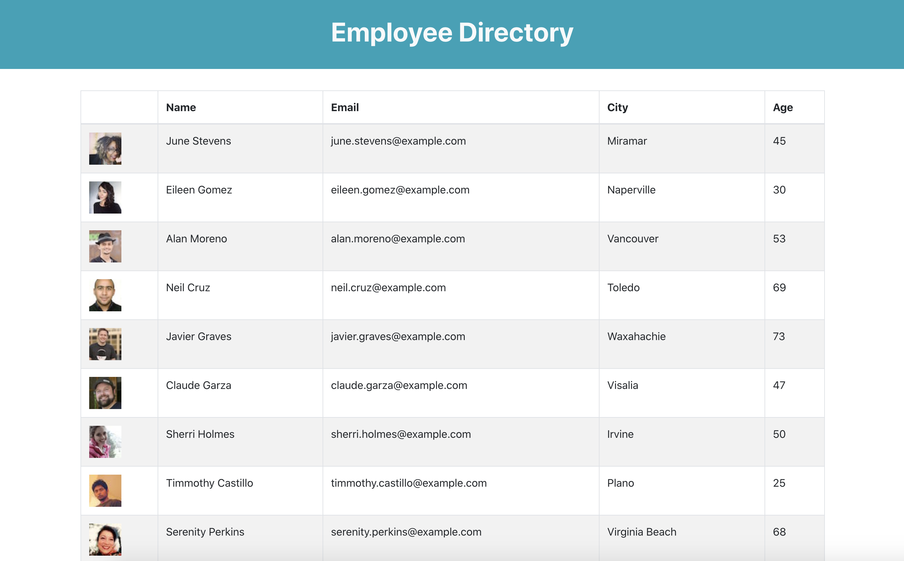

# Employee Directory

## Description

This is an Employee Directory Application. An employee or manager can view the entire employee directory at once to have quick access to non-sensitive information about other employees.

## Table of Contents
  1. [Installation](#Installation)
  2. [License](#License)
  3. [Contributing](#Contributing)
  4. [Questions](#Questions)

## Installation

No installations required. Visit the deployed application: [Employee Directory](https://achueng.github.io/Employee-Directory/)

## License

Other

## Contributing

Everyone is welcome to contribute. Please see [Questions](#Questions) below for the contact information.

## Questions

Please visit https://github.com/achueng to learn more about the developer and other projects.
  
If there are any question, issues, or concerns, please contact Agnes via email at [agneschueng2020@u.northwestern.edu](mailto:agneschueng2020@u.northwestern.edu).
